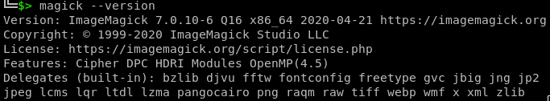

## Introduction

For some simple graphic tasks, there are equivalent command-line counterparts that
can save time and, in some cases, improve quality. 
The only problem with these simple methods is that we tend to forget them very quickly,
and usually, our most important solution to this problem is to take notes on these commands. 
Most likely, this post will serve as a notebook or cheatsheet to preserve my
experiences with such commands, and it will be gradually completed over time.

## What is ImageMagick?

[ImageMagick](https://www.imagemagick.org/) is a free and open-source software suite used for displaying, converting,
and editing raster images. It provides a command-line interface that allows you to
perform a wide range of image manipulation tasks, such as resizing, cropping, rotating,
applying filters and effects, and converting images between different formats.


## How to use it?

1. Get the universal executable binary
    ```bash
    wget https://imagemagick.org/archive/binaries/magick -O magick
    ```
2. Create a configuration folder
    ```bash
    mkdir -p ~/.config/ImageMagick/
    cat << 'EOF' >| ~/.config/ImageMagick/policy.xml
    <policymap>
        <!-- temporary path must be a preexisting writable directory -->
        <policy domain="resource" name="temporary-path" value="/data/magick"/>
        <policy domain="resource" name="memory" value="256MiB"/>
        <policy domain="resource" name="list-length" value="32"/>
        <policy domain="resource" name="width" value="8KP"/>
        <policy domain="resource" name="height" value="8KP"/>
        <policy domain="resource" name="map" value="512MiB"/>
        <policy domain="resource" name="area" value="16KP"/>
        <policy domain="resource" name="disk" value="1GiB"/>
        <policy domain="resource" name="file" value="768"/>
        <policy domain="resource" name="thread" value="2"/>
        <policy domain="resource" name="time" value="120"/>
        <policy domain="module" rights="none" pattern="URL" /> 
        <policy domain="coder" rights="write" pattern="{MSVG,MVG,PS,PDF,RSVG,SVG,XPS}" />
        <policy domain="filter" rights="none" pattern="*" />
        <policy domain="path" rights="none" pattern="-"/>  <!-- don't read/write from/to stdin/stdout -->
        <policy domain="path" rights="none" pattern="/etc/*"/>  <!-- don't read sensitive paths -->
        <policy domain="path" rights="none" pattern="@*"/>  <!-- indirect reads not permitted -->
        <policy domain="cache" name="memory-map" value="anonymous"/>
        <policy domain="cache" name="synchronize" value="true"/>
        <policy domain="cache" name="shared-secret" value="my-secret-passphrase" stealth="True"/>
        <policy domain="system" name="shred" value="1"/>
    </policymap>
    EOF
    ```
3. Make it executable and check the validity of policies
    ```bash
    chmod +x ./magick
    ./magick -list policy
    ```


If the above steps are executed without any errors, the output of the command `magick --version` will be similar to the following image:



## Display images

To display an image or image sequence on any X server:

```bash
./magick display image.jpg
```

## Converting

convert between image formats as well as resize an image, blur, crop, despeckle,
dither, draw on, flip, join, re-sample, and much more.

### Formats

#### to ICO

The ICO format is widely used as program icons and _favicons_ on websites and is a type of "container format". 
Like other container formats, it allows various contents to be placed together. 
To convert images from other formats such as PNG to ICO, you can use the following command:

```bash
./magick convert in.png -define icon:auto-resize out.ico
```

If this command completes without any errors, 
you can check the status of the output by using the following command, 
where the expected result will be similar to what is shown in the following image:

```bash
./magick identify out.ico
```


As we can see in the output result, after converting the PNG file to ICO format, 
different instances of the image in various dimensions are included in the file.

#### to PDF

```bash
# convert multi image files to pdf 
./magick convert IMG-*.jpg -resize 99% IMGS.pdf
```

### append pictures

```bash
./magick convert pic-*.jpg -append pics.jpg
```

### Resize an image

```bash
./magick convert image.jpg -resize 800x600 resized_image.jpg
```

### Crop an image

```bash
./magick convert image.jpg -crop 400x300+100+50 cropped_image.jpg
```

### Apply filter

#### blur

```bash
./magick convert image.jpg -blur 0x8 blurred_image.jpg
```

#### grayscale

```bash
./magick convert -colorspace Gray image.jpg gray_image.jpg
```


