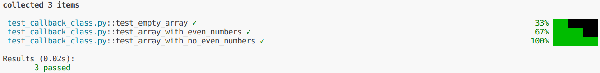
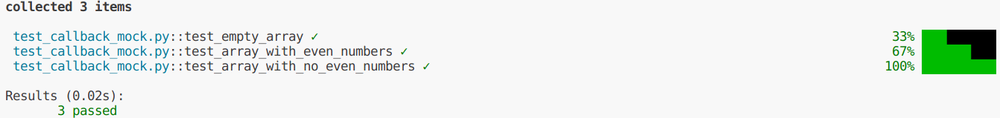

## Introduction

When it comes to detecting events within a function, callback functions offer a reliable approach. By passing a function pointer along with other arguments, you can ensure that a specific function is executed when a particular event occurs. While this pattern is widely used in structured languages like C, it is less prevalent in languages such as Python. However, there are libraries in Python that make use of this pattern to address certain challenges.

Recently, I encountered a situation where I needed to utilize a library that employed callback functions. In this blog post, we will explore this library and dive into its testing methodology, utilizing the Pytest library. By understanding how to effectively test callback functions, we can ensure their proper functionality and enhance the reliability of our codebase.

## Prepare the running environment

For running the following codes, I used `python-3.10` and `pytest` package. You can
install `pytest` using the following code:

```bash
pip install pytest
```

## A use-case: call a function on every even number

The function `process_even_numbers` takes two parameters: `numbers`, which is the input array of numbers, and `callback`, which is the function to be called for each even number.

Within the function, we iterate over each element num in the numbers array. Using the modulo operator %, we check if num is divisible by 2, i.e., an even number. If it is, we call the `callback` function and pass the even number num as an argument.

```python
def process_even_numbers(numbers, callback):
    for num in numbers:
        if num % 2 == 0:
            callback(num)
```

This simple function can be called within the following code:

```python
def print_number(num):
    print(f"Even number: {num}")

numbers = [1, 2, 3, 4, 5, 6, 7, 8, 9, 10]

process_even_numbers(numbers, print_number)
```

### Testing the function: without Pytest-mock

A very basic approach can be writing a custom class that can play the role of
a stub function, like the following `mock_callback_class` class:

```python
class mock_callback_class:
    def __init__(self):
        self.callback_called = False
    
    def __call__(self, num):
        self.callback_called = True
    
    def reset(self):
        self.callback_called = False
```

And then we can use `pytest` to write different test cases for this function such as the following code:

```python
def test_empty_array():
    mock_callback = mock_callback_class()

    # Test case 1: Empty array
    numbers = []
    process_even_numbers(numbers, mock_callback)
    assert not mock_callback.callback_called

def test_array_with_even_numbers():
    mock_callback = mock_callback_class()

    # Test case 2: Array with even numbers
    numbers = [2, 5, 8, 11, 14]

    process_even_numbers(numbers, mock_callback)
    assert mock_callback.callback_called == True

def test_array_with_no_even_numbers():
    mock_callback = mock_callback_class()

    # Test case 3: Array with no even numbers
    numbers = [1, 3, 5, 7, 9]

    process_even_numbers(numbers, mock_callback)
    assert not mock_callback.callback_called
```

In this way, we test some aspects of the following code:

```bash
pytest -vv
```


However, what if we want to verify that the callback function was called with the correct arguments?
Additionally, what if we want to check if the callback function was called multiple times?
While we could add these features to our `mock_callback_class`, it brings the question
of why we should spend time reinventing the wheel.

### Testing the function: with Pytest-mock

For using this library, you can install this package by the following command:

```bash
pip install pytest-mock
```

We can rewrite the test cases in the previous section as follows:

```python
from pytest_mock import MockerFixture

def test_empty_array(mocker: MockerFixture):
    mock_callback = mocker.Mock(return_value=None)

    # Test case 1: Empty array
    numbers = []
    process_even_numbers(numbers, mock_callback)
    assert not mock_callback.called

def test_array_with_even_numbers(mocker: MockerFixture):
    mock_callback = mocker.Mock(return_value=None)

    # Test case 2: Array with even numbers
    numbers = [2, 5, 8, 11, 14]

    process_even_numbers(numbers, mock_callback)
    assert mock_callback.called
    mock_callback.assert_has_calls(
        [
            mocker.call(2),
            mocker.call(8),
            mocker.call(14)
        ],
        any_order=False,
    )

def test_array_with_no_even_numbers(mocker: MockerFixture):
    mock_callback = mocker.Mock(return_value=None)

    # Test case 3: Array with no even numbers
    numbers = [1, 3, 5, 7, 9]

    process_even_numbers(numbers, mock_callback)
    assert not mock_callback.called
```

As you can see, in `test_array_with_even_numbers` we checked the number of calls
and their argument. Using `pytest-mock` gives us a lot of features that we can use
in different use cases.

By running pytest, we can see the same result as the following:

```bash
pytest -vv
```



## Conclution

In this article, we investigated the performance of a method of using the `pytets-mock`.
You can download the code for the first method from [(test_callback_class.py)](./test_callback_class.py)
and the code for the second method from [(test_callback_mock.py)](./test_callback_mock.py).

To view the documents related to the `pytest`, you can check its [documentation website](https://pytest-mock.readthedocs.io/en/latest/).
