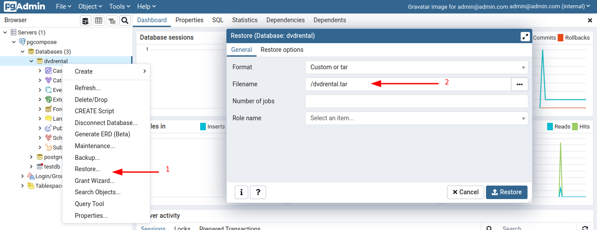
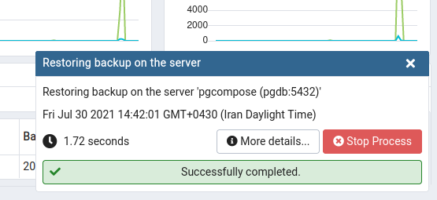

## Introduction

The `SELECT` command is one of the most fundamental and commonly used commands in SQL.
It is primarily used to retrieve data from one or more database tables.

### Sample data: DVD Rental

The website [PostgresTutorial](https://www.postgresqltutorial.com/) has prepared
a sample database for learning purposes. You can use this
[Link](https://www.postgresqltutorial.com/postgresql-sample-database/) to download
the .zip file of this sample database. In addition, 
to load this database into `PostgreSQL`, you can use the
[instruction](https://www.postgresqltutorial.com/load-postgresql-sample-database/)
provided by its website.

The following image displays the ER-Diagram of this sample database.


#### Import with pgAdmin

The mentioned dataset can be used in `PostgreSQL`. To use this dataset, first, you
can set up an environment, as described in  the post about 
<Link to="/en/blog/sql-postgresql-pgadmin-compose/" >PostgreSQL and pgAdmin with docker-compose</Link>.

Following the steps shown in the figure below, a _.tar_ file can be restored:



if you follow the steps correctly, a prompt as shown in the following figure will be displayed:




## Working with various data structures

Some commonly used data types in SQL:

1. **Numeric Data Types**:
    - `INT` or `INTEGER`: Represents integer values.
    - `FLOAT` or `REAL`: Represents floating-point numbers.
    - `DECIMAL(p, s)` or `NUMERIC(p, s)`: Represents fixed-point numbers with a specified precision (`p`) and scale (`s`).
    - `DOUBLE PRECISION`: Represents double-precision floating-point numbers.

2. **Character String Data Types**:
    - `CHAR(n)`: Represents a fixed-length string of length `n`.
    - `VARCHAR(n)`: Represents a variable-length string with a maximum length of `n`.
    - `TEXT`: Represents variable-length character data of any length.

3. **Boolean Data Type**:
    - `BOOLEAN` or `BOOL`: Represents boolean values (`TRUE` or `FALSE`).

4. **Date and Time Data Types**:
    - `DATE`: Represents a date value.
    - `TIME`: Represents a time value.
    - `TIMESTAMP`: Represents a date and time value.
    - `INTERVAL`: Represents a duration or time interval.

5. **Binary Data Types**:
    - `BINARY(n)`: Represents a fixed-length binary string of length `n`.
    - `VARBINARY(n)`: Represents a variable-length binary string with a maximum length of `n`.
    - `BLOB`: Represents binary data of variable length.

6. **Other Data Types**:
    - `ENUM`: Represents a set of predefined values.
    - `UUID`: Represents a universally unique identifier.
    - `JSON`: Represents JSON (JavaScript Object Notation) data.
    - `XML`: Represents XML data.
    - `ARRAY`: Represents an array or list of values.


### Date and Time Data Types

To obtain a list of days from a specific date to the current date, we can use the following query:

```sql
SELECT
    CURRENT_DATE as today,
    d as date_time,
    AGE(d) as age_value, -- calculate age
    d::date as date_value,
    TO_CHAR(d.*, 'YYYY/MM/DD') as formatted,
    EXTRACT(MONTH FROM d.*) as date_month
FROM GENERATE_SERIES(
    '2021-07-01',
    '2021-07-10',
    INTERVAL '1 day'
) d
LIMIT 1
```

## Basic Syntax

The basic syntax of the SELECT command is as follows:

```sql
SELECT column1, column2, ...
FROM table_name;
```
### Alias

Defining an _alias_ for a table and using it. here `a` is an alias for table `actor`, 
and as you can see we have used this alias in the SELECT statement for selecting
columns `first_name` (-->a.first_name) and `last_name` (-->a.last_name) of the table `actor`.

```sql
SELECT a.first_name, a.last_name
FROM actor a
```

### ORDER BY

To sort data based on the values in one or more columns, use the `ORDER BY` statement. 
You can either name a column or the number of the column in the `SELECT` statement which starts from 1.
After specifying the "number of the column" in the `ORDER BY` statement, you should state whether you want to sort the data in Ascending (ASC) or Descending (DESC) order. 
If you don't mention the sorting order, the default which is `ASC` will be applied.
In the following example, firstly rows will be sorted based on descending order of the second column in the SELECT statement (which is _amount_),
then they will be sorted based on the ascendingly order of the first column in the `SELECT` statement (which is _payment_date_).
Of course, if you use the name of the columns instead of their number, the whole query will become more readable.

```sql
SELECT payment_date,amount
FROM payment
ORDER BY 2 DESC, 1 ASC
```
### WHERE

Suppose we want to put a condition on the month of a date field like `payment_date`, then we can do it as follows:

```sql
SELECT payment_date,amount
FROM payment
WHERE EXTRACT(MONTH FROM payment_date) = 3
```

Suppose you have a question like "Find the number of payments during the second month of the year.", 
The following query can be used to answer this question. Here, `COUNT(*)` counts the number of rows with specified conditions.

```sql
SELECT COUNT(*)
FROM payment
WHERE EXTRACT(MONTH FROM payment_date) IN (2)
```

### GROUP BY

Suppose you have a question like "Find an array of days in which each customer has at least one payment", 
The following query can be used to answer this question. Here, the _ARRAY_AGG_ function is used to aggregate multiple rows into an array. 

```sql
SELECT customer_id,ARRAY_AGG(payment_date::date)
FROM payment
GROUP BY customer_id
```


### HAVING

Suppose you want to answer a question like "What is the total income of days which has more than one payment in the third month". 
The following query can be used to answer this question. Please note that to apply conditions on aggregated fields/functions like COUNT, SUM, MIN, MAX, etc., we have to use `HAVING` statement;
WHERE statement can only apply conditions on non-aggregate fields/functions. Also note that `::date` is used to cast _payment_date_ to the `DATE` data type.

```sql
SELECT payment_date::date,COUNT(*),SUM(amount)
FROM payment
WHERE EXTRACT(MONTH FROM payment_date) = 3
GROUP BY 1
HAVING COUNT(*) > 1
```


## JOIN

Suppose you have a question like "Retrieve name and full address of all employees.", the following query can be used to answer this question. 
Here, tables _address_ and _staff_ are joined based on the condition `staff.address_id = address.address_id`. Therefore, only rows that fulfill this last condition will appear in the result.

```sql
SELECT address.address_id, address.address, staff.staff_id
FROM address
JOIN staff ON staff.address_id = address.address_id
```

Suppose you have a question like "How many addresses do not belong to employees?", the following query can be used to answer this question. 
Another way to answer this question is to SUBTRACT the number of rows in tables _address_ from the number of rows in table _staff_.

```sql
SELECT count(*)
FROM address
LEFT JOIN staff ON staff.address_id = address.address_id
WHERE staff.staff_id IS NULL
```
Suppose you have a question like "Find number of days in the second month of the year 2007 during which no payments were made.", the following query can be used to answer this question. 
The generate_series() function generates a series of values based on the specified parameters. Here, generate_series() is used to create a series of dates within the range of '2007-02-01' to '2007-03-01'.

```sql
SELECT count(*)
FROM GENERATE_SERIES('2007-02-01', '2007-03-01', INTERVAL '1 day') d
LEFT JOIN payment ON payment.payment_date::date = d::date
WHERE payment_id IS NULL
```
Suppose you have a question like "Find the number of days in the second month of the year 2007 during which at least one payment were made.", the following query can be used to answer this question. 

```sql
SELECT count(
    DISTINCT EXTRACT(
        DAY from payment.payment_date::date
        )
    )
FROM GENERATE_SERIES(
    '2007-02-01', '2007-03-01', INTERVAL '1 day'
    ) d
LEFT JOIN payment
    ON payment.payment_date::date = d::date
WHERE payment_id IS NOT NULL
```
Be cautious when using `WHERE` alongside `LEFT JOIN`, as it will be applied to the final results. 
Sometimes we need to apply the condition during the execution of the `JOIN` statement. In these kinds of situations, it is better to bring the condition into the `ON` using the `AND` operator.

## Nested Queries

Suppose you have a question like "Find the stores from which each customer has made a purchase.".
On one hand, we can find employees who have rented films in the _rental_ table. On the other hand, using  _staff_ table, we can find stores where employees work in them.
Therefore, the following query can be used to answer the above-mentioned question. 

```sql
SELECT DISTINCT r.customer_id, s.store_id
FROM rental r
    LEFT JOIN staff s
        ON s.staff_id = r.staff_id
ORDER BY 1
```
Suppose you have a question like "How many stores each customer has purchased from?", the following query can be used to answer this question. 

```sql
SELECT customer_store.customer_id, COUNT(*)
FROM (
    SELECT DISTINCT r.customer_id, s.store_id
    FROM rental r
        LEFT JOIN staff s
            ON s.staff_id = r.staff_id
    ORDER BY 1
)customer_store
GROUP BY 1
```

## Common table expression (CTE)

A cleaner approach to answering the question "How many stores each customer has purchased from?" is to use `sql>WITH AS` in the way we have used it in the following query:

```sql
WITH customer_store AS (
    SELECT DISTINCT r.customer_id, s.store_id
    FROM rental r
        LEFT JOIN staff s
            ON s.staff_id = r.staff_id
    ORDER BY 1
)

SELECT customer_id, COUNT(*)
FROM customer_store
GROUP BY 1
```
It is worth mentioning that CTEs won't be saved and they are solely used to simplify the main query.

In some implementations of RDBMSs, only one WITH statement can be used in each query.
Using that implementation, if several CTEs are needed for a query, you should define them sequentially 
as it is shown in the following example:

```sql
WITH cte_1 AS(
    SELECT ...
), cte_2 AS(
    SELECT ...
)
```

## Correlating several queries

Suppose you have a question like "Find the ID and date of the first order of each customer.".
Since GROUP BY is executed on _rental_date_ in the following query, it will display the "first order in each day" instead of displaying "ID and date of the first order of each customer".
Therefore, this query CANNOT be used to answer the question.

```sql
SELECT r.customer_id, r.rental_date, min(r.rental_id) as first_order_id
FROM rental r
GROUP BY 1,2
ORDER BY 1
```

But we can answer the "Find ID and date of the first order of each customer." question using the following query:

```sql
SELECT
    r.customer_id,
    min(r.rental_id) as first_order_id,
    (
        SELECT r2.rental_date
        FROM rental r2
        WHERE r2.rental_id = min(r.rental_id)
    )::date as first_order_date
FROM rental r
GROUP BY 1
ORDER BY 1
```

Another way to answer the "Find ID and date of the first order of each customer." question is to use the following query:

```sql
SELECT r.customer_id,r.rental_id as first_rental_id,r.rental_date as first_order_date
FROM rental r
WHERE r.rental_id = (
    SELECT MIN(r2.rental_id)
    FROM rental r2
    WHERE r2.customer_id = r.customer_id
)
ORDER BY r.customer_id
```
Yet another way to answer the "Find ID and date of the first order of each customer." question is to use the following query:

```sql
SELECT r.customer_id,r.rental_id as first_rental_id,r.rental_date as first_order_date
FROM rental r
JOIN (
    SELECT customer_id, MIN(rental_id) as rental_id
    FROM rental
    GROUP BY customer_id
)r2 ON r.rental_id = r2.rental_id
ORDER BY r.customer_id
```

To observe the difference in the results of the three above-mentioned solutions, 
the following method can be used (the result of the following command is zero, indicating the consistency of the results):

```sql
WITH s1 AS (
    SELECT
        r.customer_id,
        MIN(r.rental_id) AS first_rental_id,
        (
            SELECT r2.rental_date
            FROM rental r2
            WHERE r2.rental_id = min(r.rental_id)
        )::date AS first_order_date
    FROM rental r
    GROUP BY 1
    ORDER BY 1
),
s2 AS (
    SELECT r.customer_id,
        r.rental_id AS first_rental_id,
        r.rental_date as first_order_date
    FROM rental r
    WHERE r.rental_id = (
        SELECT MIN(r2.rental_id)
        FROM rental r2
        WHERE r2.customer_id = r.customer_id
    )
    ORDER BY r.customer_id
),
s3 AS (
    SELECT r.customer_id,
        r.rental_id AS first_rental_id,
        r.rental_date AS first_order_date
    FROM rental r
    JOIN (
        SELECT customer_id,
            MIN(rental_id) AS rental_id
        FROM rental
        GROUP BY customer_id
    )r2 ON r.rental_id = r2.rental_id
    ORDER BY r.customer_id
)

SELECT COUNT(*) FROM s1
FULL OUTER JOIN s2
    ON s1.first_rental_id = s2.first_rental_id
FULL OUTER JOIN s3
    ON s1.first_rental_id = s3.first_rental_id
WHERE s1.first_order_date IS NULL
    OR s2.first_order_date IS NULL
    OR s3.first_order_date IS NULL
```

## CASE

Suppose you have a question like "Replacement cost for each film is more or less than the average?", the following query can be used to answer this question. 

```sql
SELECT film_id, title, replacement_cost,
CASE
    WHEN replacement_cost > (
        SELECT AVG(replacement_cost)
        FROM film
        )
    THEN 'gt_avg'
    ELSE 'le_avg'
    END AS replacement_cost_status
FROM film
```
Probably the most common way to answer this question is to use the `UNION` statement if you don't want to use the `CASE` statement.

### Window Function

Suppose you have a question like "How many films exist in each rating category?", the following query can be used to answer this question. 

```sql
SELECT DISTINCT f.rating, f.film_count
FROM (
    SELECT
        rating,
        COUNT(*) OVER (
            PARTITION BY rating
            ) AS film_count
    FROM film
) f
```
Notice the usage of sql> window_function OVER(PARTITION BY field) in the above query. 
When we need to aggregate data, we can use `GROUP BY`, 
and when we want to analyze data in a categorized manner, we can use `PARTITION BY`.

