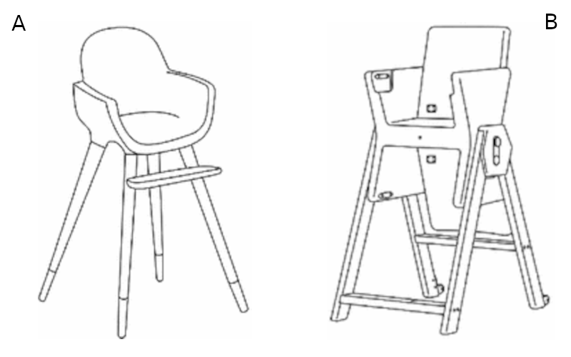
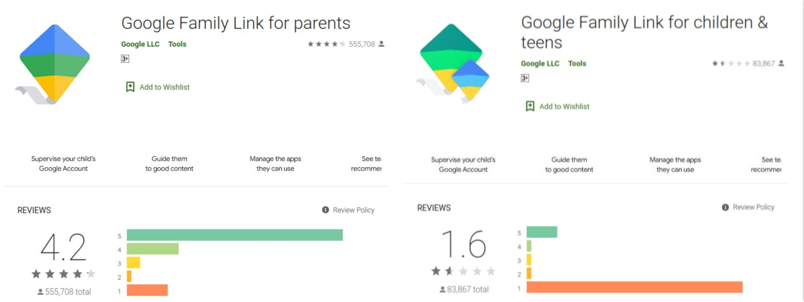

The summer before COVID, my family and I went out for dinner at a kebab restaurant.

We placed our order and were waiting when two other families walked in and sat
at the table next to us. One of them had a little girl, around three years old.

From the very moment she sat down, the child started complaining loudly:
*“Bring **my** chair.”*

Her mother asked the restaurant staff to bring a child’s chair, but the girl
impatiently kept repeating:
*“Bring **my** chair.”*

Clearly exhausted, the mother said:

> “I don’t know why every time we come to this place she gets so obsessed with
the chair! What’s funny is that at home she never even sits on her own child
chair!”

The waiter brought over the restaurant’s high chair and placed it next to the
table. The mother lifted the child and sat her down.

The complaining instantly turned into joy, and with a big smile the girl said:

**“My feet can reach!”**

That sentence stopped me.

If the child hadn’t expressed her need so clearly, the chances of identifying
the real reason behind her reaction would have been very low. The restaurant
chair (Chair A) had a place to rest her feet, while the chair at home (Chair B)
most likely didn’t.

## When the buyer is not the user

In the book *Design Brief* (which I have reviewed separately in my personal library), one of the core challenges designers face is the lack of a shared language with clients. Designers often focus on aesthetics and craft, while clients care about business value, timelines, and risk.

When designing products for children, however, an even more fundamental problem appears:

> The buyer is not the user.

Parents or guardians make purchasing decisions based on *their* criteria, while
someone else, the child, lives with the product every day.

<figure>
  
  <figcaption>Source [^1]</figcaption>
</figure>

In the story above, the parents purchased Chair B for their daughter. From their
perspective, it likely met many reasonable requirements: durability, adjustability,
safety, visual appeal, brand trust, and long-term usability.

But from the child’s perspective, none of that mattered as much as one simple thing:

**“My feet can reach.”**

If the child had been able to express this need earlier, and if the parents had truly had a choice, would they have abandoned their own criteria and chosen Chair A instead?

## When the story doesn’t end with a chair

It would be easy to blame the manufacturer of Chair B for ignoring children’s
needs. But the problem becomes more serious when we notice that much larger and
more sophisticated organizations struggle with the same challenge.

If you are a parent concerned about your child’s online safety, you may be
familiar with **Google Family Link**, a parental control service for Android
devices.

Below is a comparison of app ratings in Google Play:

* **Left**: the app installed on parents’ phones [^2]
* **Right**: the app installed on children’s or teenagers’ devices [^3]

Parents are generally satisfied.
Children are overwhelmingly unhappy.

Some of this gap is expected, children do not enjoy restrictions. But many
complaints are not about *rules*, they are about *experience*. One of the most
common complaints from children is **battery drain**.

Is this technically solvable? Probably.
Is it prioritized? Maybe not.

If the buyers are happy, performance issues experienced by users may never rise
to the top of the backlog.

## Where the real challenge appears

The hardest design problems emerge when parents’ criteria and children’s needs
are in direct conflict.

In the chair example, if safety and long-term usability dominate the parents’
decision-making, Chair B might still be the right product, even if the child
dislikes it. From a business perspective, Chair B may even be more successful.

But that success is fragile.

If Chair A evolves to satisfy parents’ requirements *as well*, manufacturers of
Chair B may lose market share without ever understanding why.

The same pattern applies to parental control software. It may be impossible to
fully satisfy both parents and children at the same time. But usability,
performance, and basic respect for the child’s experience are not optional,
they are the minimum responsibility of anyone designing systems for users who
do not have purchasing power.

[^1]: Salvador, Cristina. *Ergonomics in the Design Process – Study of Adaptability of Evolutive High Chairs.* International Conference on Applied Human Factors and Ergonomics. Springer, 2017.
[^2]: [Google Family Link for parents](https://play.google.com/store/apps/details?id=com.google.android.apps.kids.familylink&hl=en)
[^3]: [Google Family Link for children & teens](https://play.google.com/store/apps/details?id=com.google.android.apps.kids.familylinkhelper&hl=en)
