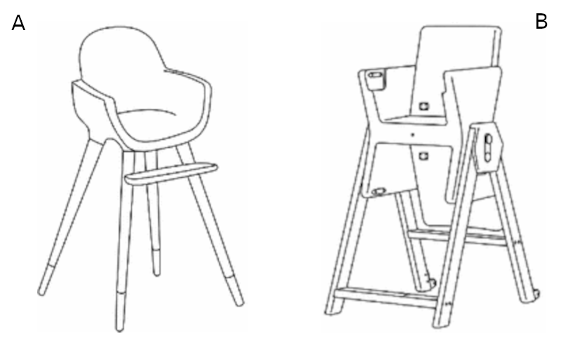
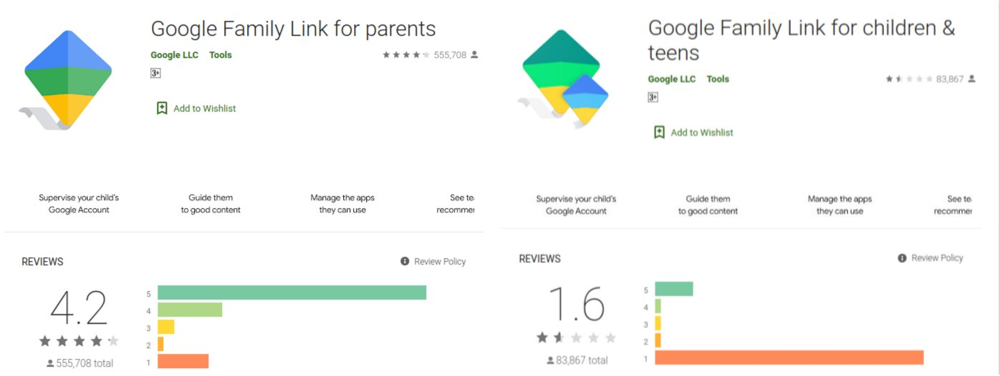

تابستان قبل از کرونا، من و خانواده‌ام برای شام به یک کبابی رفتیم.

سفارش‌مان را دادیم و منتظر بودیم که دو خانواده دیگر وارد شدند و پشت میز کناری ما نشستند. یکی از آن‌ها دختر کوچکی داشت، حدود سه ساله.

از همان لحظه‌ای که نشست، بچه شروع کرد به شکایت کردن با صدای بلند:
*«صندلی **من** رو بیارید.»*

مادرش از کارکنان رستوران خواست که صندلی بچه بیاورند، ولی دختر بی‌صبرانه تکرار می‌کرد:
*«صندلی **من** رو بیارید.»*

مادر که معلوم بود خسته شده، گفت:

> «نمی‌دونم چرا هر بار که میایم اینجا، این‌قدر گیر می‌ده به صندلی!
خنده‌دار اینه که خونه اصلا روی صندلی بچه‌اش نمی‌شینه!»

گارسون صندلی بلند بچه رستوران را آورد و کنار میز گذاشت. مادر بچه را بلند کرد و روی صندلی نشاند.

شکایت‌ها فوری تبدیل به شادی شد، و دختر با لبخند بزرگی گفت:

**«پاهام می‌رسه!»**

این جمله مرا متوقف کرد.

اگر بچه نیازش را این‌قدر واضح بیان نکرده بود، احتمال شناسایی دلیل واقعی واکنشش بسیار کم بود. صندلی رستوران (صندلی الف) جایی برای استراحت پاهایش داشت، در حالی که صندلی خانه (صندلی ب) به احتمال زیاد نداشت.

## وقتی خریدار کاربر نیست

در کتاب *Design Brief* (که جداگانه در کتابخانه شخصی‌ام معرفی کرده‌ام)، یکی از چالش‌های اصلی طراحان، نبود زبان مشترک با مشتریان است. طراحان اغلب روی زیبایی‌شناسی و هنر تمرکز می‌کنند، در حالی که مشتریان به ارزش کسب‌وکار، زمان‌بندی و ریسک اهمیت می‌دهند.

اما وقتی صحبت از طراحی محصول برای کودکان می‌شود، مشکل اساسی‌تری پدیدار می‌شود:

> خریدار کاربر نیست.

والدین یا سرپرستان بر اساس معیارهای *خودشان* تصمیم خرید می‌گیرند، در حالی که شخص دیگری، یعنی کودک، هر روز با محصول زندگی می‌کند.

<figure>
  
  <figcaption>منبع [^1]</figcaption>
</figure>

در داستان بالا، والدین صندلی ب را برای دخترشان خریدند. از دید آن‌ها، احتمالا معیارهای معقول زیادی را برآورده می‌کرد: دوام، قابلیت تنظیم، ایمنی، جذابیت ظاهری، اعتماد به برند، و قابلیت استفاده بلندمدت.

اما از دید کودک، هیچ‌کدام از این‌ها به اندازه یک چیز ساده مهم نبود:

**«پاهام می‌رسه.»**

اگر کودک می‌توانست این نیاز را زودتر بیان کند، و اگر والدین واقعا حق انتخاب داشتند، آیا معیارهای خودشان را کنار می‌گذاشتند و صندلی الف را انتخاب می‌کردند؟

## وقتی داستان با یک صندلی تمام نمی‌شود

ساده است که سازنده صندلی ب را به خاطر نادیده گرفتن نیازهای کودکان سرزنش کنیم. اما مشکل وقتی جدی‌تر می‌شود که می‌بینیم سازمان‌های بسیار بزرگ‌تر و پیچیده‌تر هم با همین چالش دست‌وپنجه نرم می‌کنند.

اگر والدینی هستید که نگران امنیت آنلاین فرزندتان است، احتمالا با **Google Family Link** آشنا هستید، یک سرویس کنترل والدین برای دستگاه‌های اندرویدی.

در زیر مقایسه‌ای از امتیازات اپلیکیشن در گوگل پلی آمده است:

* **چپ**: اپلیکیشن نصب‌شده روی گوشی والدین [^2]
* **راست**: اپلیکیشن نصب‌شده روی دستگاه‌های کودکان یا نوجوانان [^3]

والدین به طور کلی راضی هستند.
کودکان به شدت ناراضی هستند.

بخشی از این شکاف قابل انتظار است؛ کودکان از محدودیت‌ها لذت نمی‌برند. اما بسیاری از شکایات درباره *قوانین* نیست، درباره *تجربه* است. یکی از رایج‌ترین شکایات کودکان **مصرف بالای باتری** است.

آیا این از نظر فنی قابل حل است؟ احتمالا.
آیا اولویت‌بندی شده؟ شاید نه.

اگر خریداران راضی باشند، مشکلات عملکردی که کاربران تجربه می‌کنند ممکن است هرگز به بالای لیست اولویت‌ها نرسد.

## جایی که چالش واقعی ظاهر می‌شود

سخت‌ترین مسائل طراحی زمانی پدید می‌آیند که معیارهای والدین و نیازهای کودکان در تضاد مستقیم باشند.

در مثال صندلی، اگر ایمنی و قابلیت استفاده بلندمدت بر تصمیم‌گیری والدین غالب باشد، صندلی ب ممکن است همچنان محصول درست باشد، حتی اگر کودک از آن خوشش نیاید. از منظر کسب‌وکار، صندلی ب حتی ممکن است موفق‌تر باشد.

اما این موفقیت شکننده است.

اگر صندلی الف تکامل یابد و نیازهای والدین را *نیز* برآورده کند، سازندگان صندلی ب ممکن است سهم بازار خود را از دست بدهند بدون اینکه هرگز بفهمند چرا.

همین الگو برای نرم‌افزار کنترل والدین هم صدق می‌کند. شاید غیرممکن باشد که همزمان هم والدین و هم کودکان را کاملا راضی کرد. اما قابلیت استفاده، عملکرد، و احترام پایه به تجربه کودک اختیاری نیست - این‌ها حداقل مسئولیت هر کسی است که سیستم‌هایی را برای کاربرانی طراحی می‌کند که قدرت خرید ندارند.

[^1]: Salvador, Cristina. *Ergonomics in the Design Process – Study of Adaptability of Evolutive High Chairs.* International Conference on Applied Human Factors and Ergonomics. Springer, 2017.
[^2]: [Google Family Link for parents](https://play.google.com/store/apps/details?id=com.google.android.apps.kids.familylink&hl=en)
[^3]: [Google Family Link for children & teens](https://play.google.com/store/apps/details?id=com.google.android.apps.kids.familylinkhelper&hl=en)
